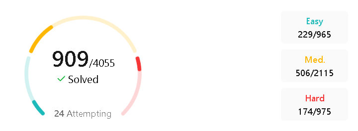

<!-- ═══════════════════════ NAV BAR ═══════════════════════ -->

<a href="#-about">ABOUT</a> &nbsp;·&nbsp;
<a href="#-experience">EXPERIENCE</a> &nbsp;·&nbsp;
<a href="#-featured-work">WORK</a> &nbsp;·&nbsp;
<a href="#-dsa--problem-solving">DSA</a> &nbsp;·&nbsp;
<a href="#-current-focus">FOCUS</a> &nbsp;·&nbsp;
<a href="#-github-stats">STATS</a> &nbsp;·&nbsp;
<a href="#-connect">CONNECT</a>

<!-- ═══════════════════════ QUICK LINKS ═══════════════════════ -->

 

 

<!-- ═══════════════════════ ABOUT ═══════════════════════ -->

## 🚀 About

Computer Engineering undergraduate at **Nirma University** (B.Tech CSE, 2023–2027 · CGPA **8.03/10**) with a strong competitive programming foundation and hands-on experience building production-grade web applications. **Ex-SWE Intern @ Google**.

As a **Full Stack Developer**, I specialize in engineering scalable web applications and high-throughput backend services. From architecting responsive MERN platforms with multi-tier Redis caching to developing diagnostic data utilities and predictive analytics pipelines, I build reliable, production-ready software designed for performance and scale.

<table width="100%">
<tr><td width="50%" valign="top">

**What I care about**

- Scalable, low-latency web architectures and distributed caching
- Clean schema modeling, indexing, and efficient relational query pipelines
- Elegant full-stack interfaces paired with resilient RESTful APIs
- Strong algorithmic foundations — solving hard problems with optimal complexity
- Writing clean, maintainable, and type-conscious production code

</td>
<td width="50%" valign="top">

**Quick Facts**

|                |                                                             |
| -------------- | ----------------------------------------------------------- |
| 📍 Location    | Ahmedabad, India                                            |
| 🎓 Education   | B.Tech CSE — Nirma University (2023–2027)                   |
| 💼 Latest Role | Ex-SWE Intern @ Google                                      |
| 🏫 High School | JP Thakkar High School (HSC: 98.29%ile · JEE: 98.25%ile)    |
| 🗣️ Languages   | English, Hindi, Gujarati                                    |

</td>
</tr>
</table>

 

<!-- ═══════════════════════ EXPERIENCE ═══════════════════════ -->

## 💼 Experience

<table width="100%">
<tr><td>

### Google IT Services India Private Limited — Ex-SWE Intern

`May 2026 – July 2026` · Bengaluru, India

- Worked with system performance analysis tools to enhance trace-based debugging workflows for input devices.
- Developed Protocol Buffers–based utilities for structured event tracing alongside Python-based utilities to process and prepare diagnostic data for interactive visualization.
- Contributed to internal developer tooling by migrating a web-based visualization tool to a cloud platform and authoring automated tests to ensure software quality and reliability.

**Key Skills & Tools:** `Protocol Buffers` `Python` `Cloud Migration` `Developer Tools` `Software Testing & Reliability`

</td></tr>
</table>

 

<!-- ═══════════════════════ FEATURED WORK ═══════════════════════ -->

## 🏗 Featured Work

<table width="100%">
<tr><td>

### 🎥 VideoTube — Scalable Full-Stack Video Platform

A production-ready video hosting and streaming platform engineered using the MERN stack with secure JWT-based authentication, token refreshment, and granular channel authorization. Incorporates Cloudinary asset management for automated media uploads and delivery, nested playlist curation, real-time comment threads, and subscriber channel control. Integrated high-performance Redis caching to accelerate high-frequency read operations such as view counts, video likes, and watch-history retrieval, drastically mitigating database bottlenecks and optimizing latency.

**Stack:** `React.js` `Node.js` `Express.js` `MongoDB` `Redis` `Cloudinary` `JWT` `REST API`

**Links:**

</td></tr>
<tr><td>

### 🏏 Cricket Scorecard Management — Object-Oriented Match Simulation Engine

A comprehensive tournament and scorecard simulation platform built in Java, leveraging robust Object-Oriented Programming (OOP) paradigms and structured architectural patterns. Models end-to-end match workflows including venue-based conditions, probabilistic toss simulation, live ball-by-ball score tracking, dynamic run-rate calculation, and automated super-over resolution for tie matches. Features resilient file handling protocols for structured local storage, game record persistence, and real-time state restoration.

**Stack:** `Java` `OOP Paradigms` `File Handling` `System Simulation` `Data Structures`

**Links:**

</td></tr>
<tr><td>

### 🏦 Bank Customer Churn Prediction — Machine Learning Pipeline

An end-to-end predictive machine learning system developed to classify and identify banking customers with high attrition propensity. Built complete data pre-processing and feature engineering pipelines, handling missing values, categorical encoding, feature scaling, and class imbalance. Evaluated multiple classification models across precision, recall, ROC-AUC, and F1-score to maximize early identification and actionable insights for customer retention teams.

**Stack:** `Python` `Machine Learning` `Scikit-Learn` `Pandas` `NumPy` `Exploratory Data Analysis`

**Links:**

</td></tr>
</table>

 

<!-- ═══════════════════════ DSA & PROBLEM SOLVING ═══════════════════════ -->

## 🧠 DSA & Problem Solving

<table width="100%">
<tr><td width="50%" valign="top">

| Platform | Rating / Solved | Profile |
| :--- | :--- | :--- |
| **LeetCode** | **909 Solved** (174 Hard · 506 Med) |  |
| **Codeforces** | **1346 Max Rating** |  |
| **GeeksforGeeks** | **89 Solved** |  |

Competitive programming and algorithmic problem solving are core pillars of my engineering mindset. Daily practice on complex data structures, trees, graphs, dynamic programming, and algorithm optimization keeps problem-solving instincts razor-sharp for building efficient web applications and acing technical challenges.

</td><td width="50%" valign="top" align="center">

</td></tr>
</table>

 

<!-- ═══════════════════════ CURRENT FOCUS ═══════════════════════ -->

## 🎯 Current Focus

| Area | Status |
| :--- | :--- |
| 🚀 Scalable Full-Stack Web Architectures | `Active Focus` |
| ⚡ High-Throughput Backend & Distributed Caching | `In Progress` |
| 🐳 Docker & Containerized Deployments | `Applying in Production` |
| ☸️ Kubernetes & Cloud Infrastructure | `Learning & Exploring` |

 

<!-- ═══════════════════════ GITHUB STATS ═══════════════════════ -->

## 📊 GitHub Stats

  

<!-- Contribution Snake Animation -->
<picture>
  <source media="(prefers-color-scheme: dark)" srcset="https://raw.githubusercontent.com/Sumeet1410/Sumeet1410/output/dist/snake-dark.svg" />
  
</picture>

🐍 Snake animation powered by the <code>.github/workflows/snake.yml</code> GitHub Action.

 

<!-- ═══════════════════════ CONNECT ═══════════════════════ -->

## 🌐 Connect

 

<!-- ═══════════════════════ FOOTER ═══════════════════════ -->

⭐ _"Systems that scale, code that endures."_ ⭐

